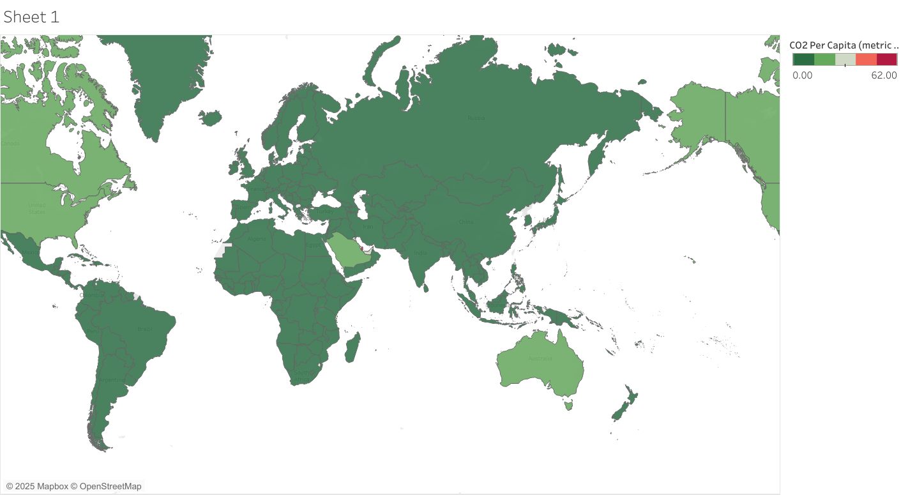

# 🌍 Global CO₂ Emissions Per Capita Visualization

This project visualizes carbon dioxide (CO₂) emissions per capita across countries using Tableau. It provides a geospatial overview of how emissions vary globally, helping users understand regional climate impact patterns.

## 📊 Dataset Description

The dataset includes the following fields:

- **Country** – Name of the country  
- **ISO Code** – Country ISO alpha-3 code  
- **Year** – Year of emission record  
- **CO₂ per capita** – Metric tons of CO₂ emitted per person  

**Source**: [Our World in Data](https://ourworldindata.org/co2-emissions) (or replace with your actual data source)

## 🔍 Key Features

- Interactive world map with country-level emission data  
- Color gradient representing emission intensity  
- Year filter for temporal comparison  
- Hover tooltips for detailed statistics  

## 💡 Insights Discovered

- **High CO₂ per capita**: Qatar, Kuwait, and the U.S. show consistently high per capita emissions  
- **Low CO₂ per capita**: Many African and island nations have low emissions  
- **Disparity**: Developed countries emit significantly more per capita than developing nations  
- **Trend**: Some countries show decreasing emissions due to policy changes and renewable energy use

## 📌 How to Use

1. Open the Tableau dashboard from the link below  
2. Use filters to explore emissions by year or country  
3. Hover over countries to see CO₂ data

🔗 **View Dashboard**: [Click here to open the Tableau Visualization](https://public.tableau.com/profile/purvi.pandey/viz/CO2Aroundworld/Sheet1)  

## 📁 Files Included

- `CO2 Around world.pptx`: Project presentation  
- `co2_data.csv`: Raw dataset  
- `Sheet.png`: Tableau dashboard snapshot  

## 📬 Contact

For questions or feedback, feel free to open an issue or contact via GitHub.
